```{r setup, include=FALSE}
knitr::opts_chunk$set(echo = FALSE)
```

# Data Prepartaion

# 1.0 Extracting and preparing layer
## 1.1 Study Area
Bring in BATAS_DESA_DESEMBER_2019_DUKCAPIL_KALIMANTAN_TIMUR.shp into QGIS.

From the Attributes toolbar, select Attributes Table
Click Select features using an expression
Enter the following code

"KAB_KOTA" in ( 'KOTA BALIKPAPAN' , 'KOTA SAMARINDA' ) or  "KECAMATAN" in ( 'ANGGANA' , 'BABULU' , 'LOA JANAN' , 'LOA KULU' , 'MARANG KAYU' , 'MUARA JAWA' , 'PENAJAM' , 'SAMBOJA' , 'SANGA SANGA' , 'SEBULU' , 'SEPAKU' , 'TENGGARONG' , 'TENGGARONG SEBERANG' , 'WARU' , 'MUARA BADAK' )

Click on Select Features
Click on Close
Right click on the population layer in the Layers toolbar
Select Export -> Save selected features as
Set the Format to GeoPackage from the drop down
Set the layer name to study_area
Set the CRS to EPSG:23845
Click Ok

## 1.2 Road layer
Bring in gis_osm_roads_free_1.shp into QGIS

From the menu bar, select Vector -> Research tools -> Select by Location.
For Select feature from select gis_osm_roads_free_1.shp from the drop down list.
For Where the features (geometric predicate), check intersect check box.
For By comparing to the features from, select study_area from the drop down list.
Click the Advanced options beside study_area and choose Do not Filter (Better Performance) for Invalid features filtering

```{r}
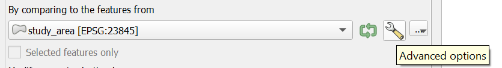
```
```{r}
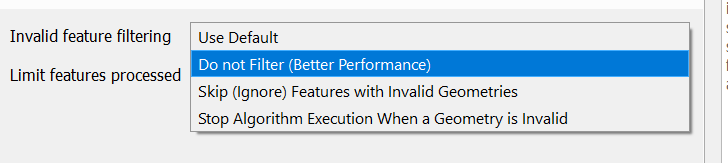
```
```{r}
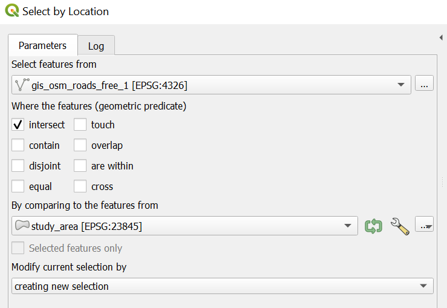
```
```{r}
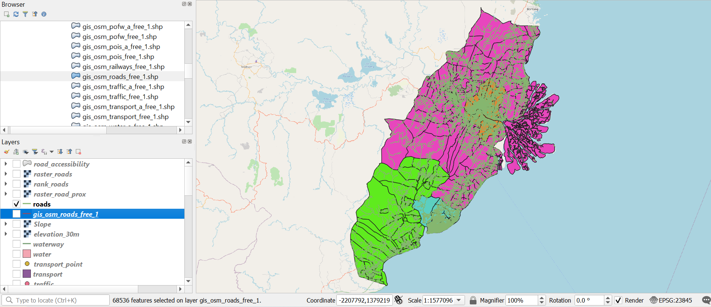
```
Save the selected features into a geopackage and name it roads.

## 1.3 Building layer
Using the steps in 1.1.1, select gis_osm_buildings_a_free_1.shp to study_area and save it into a geopackage as building

## 1.4 Transport layer
Bring gis_osm_traffic_a_free_1.shp and gis_osm_transport_a_free_1.shp into QGIS

From the menu bar, select Vector -> Data Management Tools -> Merge Vector Layers.
For Input layers select gis_osm_traffic_a_free_1.shp and gis_osm_transport_a_free_1.shp.
For Destination CRS, select EPSG:23845 - DGN95 / Indonesia TM-3 zone 54.1.
Click Run

```{r}
knitr::include_graphics("img/images/image28.png")
```

Open attribute table of merged
From the menu bar, click select by expression
Key in the expression as shown below

```{r}
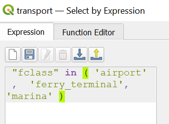
```

Click select features
Save selected features into a geopackage and name it transport

Using the steps in 1.1.1, select transport layer into study_area layer and save it into a geopackage as transport, overwriting the transport layer

From the menu bar, select Vector -> Geometry Tools -> Centroids.
For Input layers select transport from the drop down list.
Leave the rest of the fields as default
Click Run
Save the temporary Centroids into a geopackage and name it transport_centroid

From the menu bar, select Select features by freehand  and manually select transport_centroid features that are within the study area.

```{r}
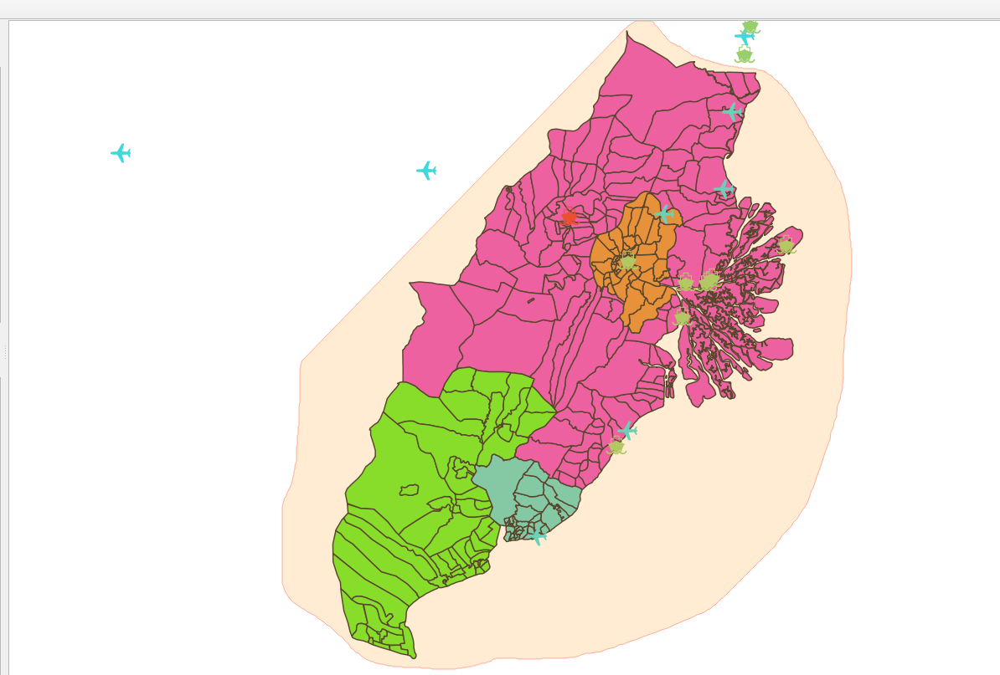
```

Open attribute table of transport_centroid
From the menu bar, Toggle editing mode and select Invert selection
Delete selected features

```{r}
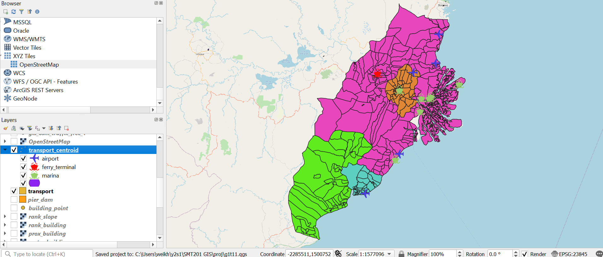
```

## 1.5 Hotspot layer
Open Titik Api Hotspot se-Indonesia Tahun [Year] into QGIS, where [Year] is 2014 - 2020.

Select the hospots that fall within the study area.
From the plugins toolbar, click Select by location 
For Input, select Titik Api Hotspot se-indonesia Tahun [Year]
Intersect should be selected
For By comparing to the features from, select study_area. Under advanced options , select Do not Filter (Better Performance)
Click Run

Relevant hotspots will be selected.
Select Export -> Save selected features as
Set the Format to GeoPackage from the drop down
Set the layer name to kalimantan
Set the CRS to EPSG:23845
For 2014, 2015 & 2017, select Points for Geometry type and untick Include z-dimension
Click Ok
Save the selected points into a geopackage and name it kalimantan_[Year]

Repeat this process for all the year.

From the Menu Toolbar, select Vector -> Data Management Tools -> Merge Vector Layer
For Input, select all 6 hotspot layers
For Destination CRS, select EPSG: 23845
Click Run
Click Close

A temporary Merged layer should be added to your map.
Select Export -> Save features as
Set the Format to GeoPackage from the drop down
Set the layer name to kalimantan
Set the CRS to EPSG:23845
Under Select fields, deselect fid
Click Run

## 1.6 Healthcare layer
Import healthcare facilities dataset to QGIS
From the Menu Toolbar, go to Vector -> Geoprocessing tools -> Clip
Set the Input Layer as healthcare facilities dataset
Set the Overlay layer as population. Select advanced options for Input layer. Select Do Not Filter
Click OK
Save the temporary Clipped layer as healthcare

## 1.7 Forest layer
Open Tuplah_Kalimantan_Timur_2019.shp

Select the area that falls within the study area.
From the plugins toolbar, click Select by location 
For Input, select Tuplah_Kalimantan_Timur_2019
Intersect should be selected
For By comparing to the features from, select study_area. Under advanced options , select Do not Filter (Better Performance)
Click Run

Select the relevant polygons that are related to forest.
From the plugins toolbar, click Select by expression
Type the following expression in the expression box:
"Legenda" in ( 'Hutan Lahan Kering Primer' , 'Hutan Lahan Kering Sekunder' , 'Hutan Mangrove Primer' , 'Hutan Mangrove Sekunder' , 'Hutan Rawa Primer' , 'Hutan Rawa Sekunder' , 'Hutan Tanaman')
Click Run
Select Export -> Save selected features as
Save the layer in the geopackage as forest

## 1.8 Agriculture layer
Open Tuplah_Kalimantan_Timur_2019.shp

Select the area that falls within the study area.
From the plugins toolbar, click Select by location 
For Input, select Tuplah_Kalimantan_Timur_2019
Intersect should be selected
For By comparing to the features from, select study_area. Under advanced options , select Do not Filter (Better Performance)
Click Run

Select the relevant polygons that are related to agriculture.
From the plugins toolbar, click Select by expression
Type the following expression in the expression box:
 "Legenda" in (  'Pertanian Lahan Kering' , 'Pertanian Lahan Kering Campur' , 'Sawah' , 'Perkebunan' )
Click Run
Select Export -> Save selected features as
Save the layer in the geopackage as agriculture

## 1.9 Waterway and Water Body layers
Open gis_osm_water_a_free_1.shp

Select the area that falls within the study area.
From the plugins toolbar, click Select by location 
For Input, select gis_osm_water_a_free_1.shp
Intersect should be selected
For By comparing to the features from, select study_area. Under advanced options , select Do not Filter (Better Performance)
Click Run
Select Export -> Save selected features as
Save the layer in the geopackage as waterway
 
Open gis_osm_waterways_free_1.shp

Select the area that falls within the study area.
From the plugins toolbar, click Select by location 
For Input, select gis_osm_waterways_free_1.shp
Intersect should be selected
For By comparing to the features from, select study_area. Under advanced options , select Do not Filter (Better Performance)
Click Run
Select Export -> Save selected features as
Save the layer in the geopackage as waterbody

# 2.0 Accessibility
Accessibility factor: <=100m = 5, 100-200m = 4, 200-300m = 3, 300-500m = 2, >500m = 1 from roads.

## 2.1 Accessibility to Roads
### 2.1.1 Creating attribute field for rasterizing
Before we can rasterize the roads layer, we need to add a control attribute field in the roads layer.
At the Layers panel, click on the Roads layer to make it active.
From the icon bar, click on the Open Attribute Table icon .
The attribute table of the roads layer appears.
From the menu bar of the roads layer attribute table, click on the Open field calculator icon.
The Field Calculator dialog window appears.
Keep Create a new field option checks.
For Output field name, type POI_CODE.
At the Expression pane, type 1.
Your screen should look similar to the figure below.

```{r}
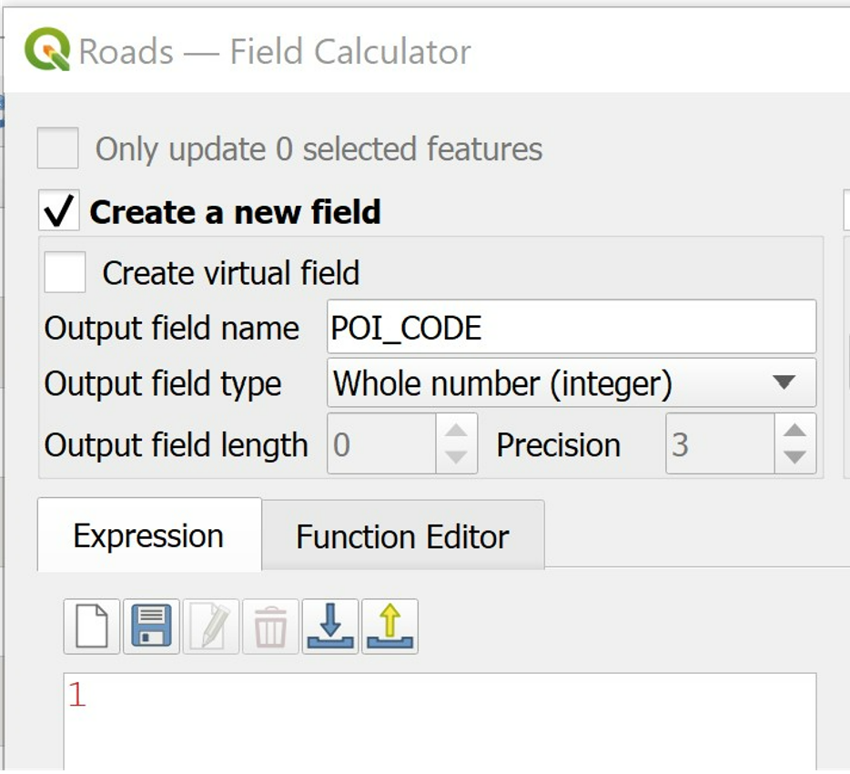
```

Click on the OK button to run the function.
Notice that a new field called POI_CODE has been added into the attribute table of roads GIS layer. Also note that all the records are indicated with POI_CODE values equals to 1.

```{r}
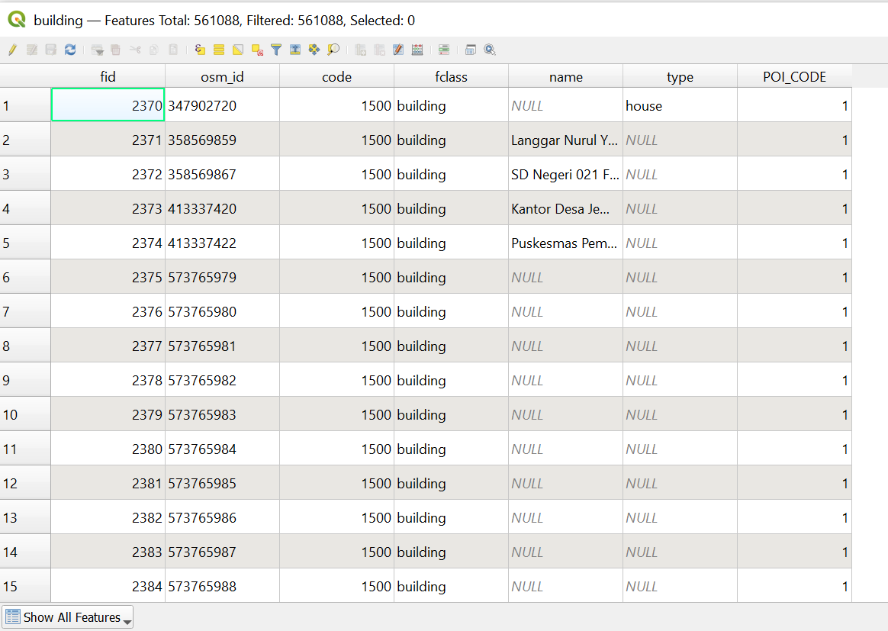
```

You are now ready to rasterize the roads layer.
Save the editing before moving on.

### 2.1.2 Rasterizing roads layer
From the menu bar, select Raster -> Conversion -> Rasterize (Vector to Raster).
The Raster (Vector to Raster) dialog window appears.
For the Input layer, select Roads from the drop-down list.
For Field to use for a burn-in value, select POI_CODE from the drop-down list.
For Output raster size units, select Georeferenced units.
Keep both horizontal and vertical resolutions at 5 (meaning 5m by 5m resolution).
For Output extent, click on Calculate from Layer.
Select study_area from the drop-down list.
When you are ready,
Click on the Run button.
When the operation ends, the dialog window will display the operation log.
Read the output display to ensure that the process has completed without any error.
After confirming that there is no error. You can close the dialog window.
Click on the Close button.
Notice that a temporary layer called Rasterized has been added in the QGIS project.

```{r}
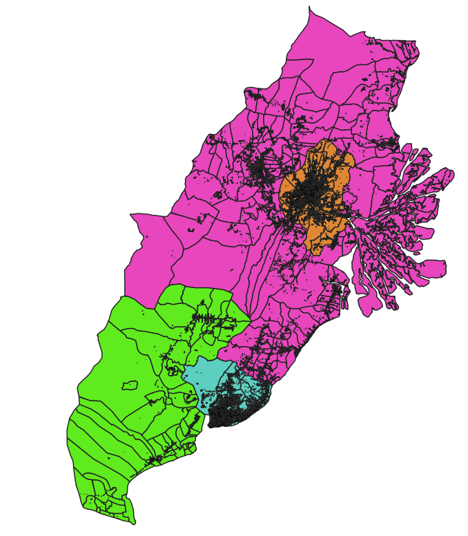
```

Save the temporary layer into GeoPackage format. Call the newly exported layer raster_roads. Next, remove the temporary layer from QGIS.

### 2.1.3 Working with Proximity function of QGIS
Now, the Proximity operation of QGIS will be used to compute the proximity to roads layer.
For the menu bar, select Raster -> Analysis -> Proximity (Raster Distance).
The Proximity (Raster Distance) dialog window appears.
For Input layer, select raster_roads from the drop-down list.
For Distance units, select Georeferenced coordinates from the drop-down list.
For Output data type, select Float32 from the drop-down list.Your screen should look similar to the screenshot below.

```{r}
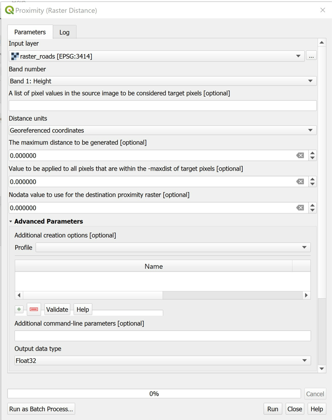
```

Click Run
Your screen should look similar to the figure below.

```{r}
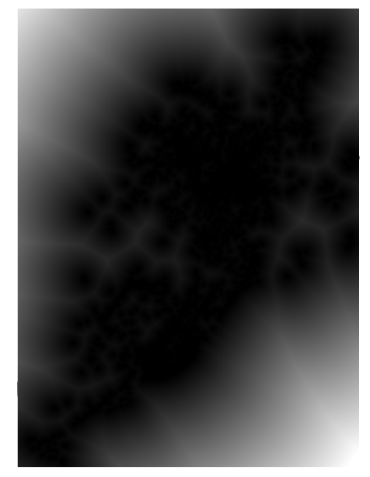
```

A temporary layer called Proximity map is created and added in the QGIS project. The legend of Proximity map layer indicates that the furthest distance from the roads is 86038 metres.
save the newly computed proximity map into GeoPackage format with a resolution of 5m x 5m. Call the layer prox_roads. Next, remove the Proximity map layer from QGIS.

### 2.1.4 Deriving road accessibility factor preference layer
From the Processing Toolbox, search for Reclassify by Table, double-click on it.

```{r}
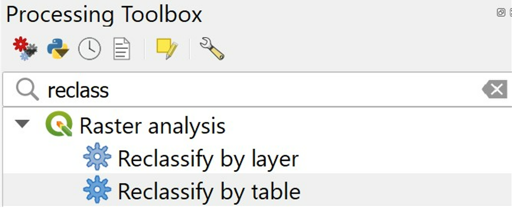
``` 

The dialog window of Reclassify by Table appears.
For Raster Layer, select slope from the drop-down list.
For the Reclassification table, click on the icon.
The dialog window of the Fixed table appears.
Enter the value similar to the screenshot below.

```{r}
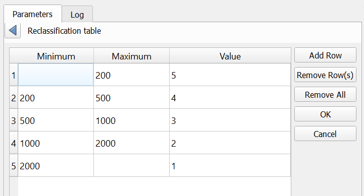
```

Reminder: Click on Add Row button when you want to add a new row.
Click on the OK button when you have completed the entry.
You will go back to the dialog window of Reclassify by Table.
For Range boundaries, select the option similar to the screenshot below.

```{r}
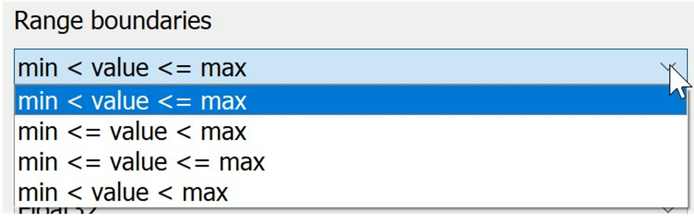
```

For Output data type, select Float32 from the drop-down list.
Lastly, click on the Run button to run the process.
Note: Pay attention to the Using classes section of the report log. This is the actual reclassification scheme defined using Fixed table and Range boundaries functions of Reclassify by Table of QGIS.

```{r}
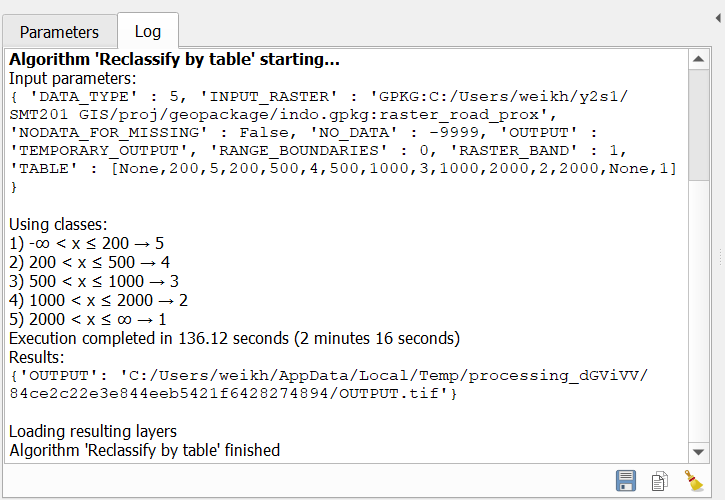
```

When you are done with reviewing the report log, click on the Close button to close the dialog window of Reclassify by Table.
Notice that a new temporary raster layer will be added on the view window of QGIS as shown in the screenshot below.

```{r}
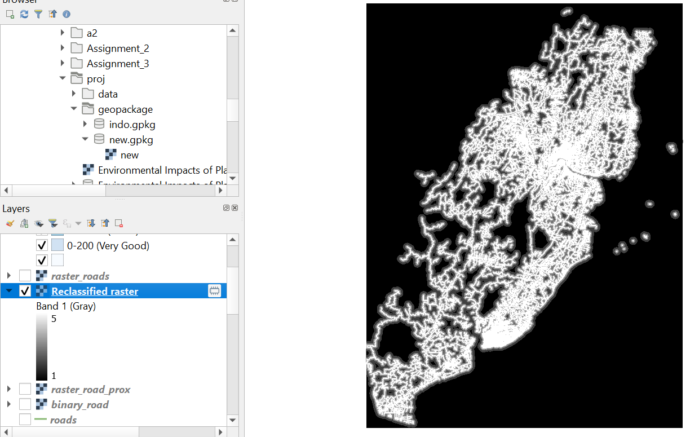
```

Using the steps you had learned in the earlier section, save the temporary raster layer into Geopackage format. Name the data layer as rank_roads. Then, remove the temporary raster layer from QGIS.
On the rank_roads layer click properties -> Symbology
For Render type select Palatted/Unique values from the drop down
For Color ramp select blues and invert Colour ramp.
Click Classify
Change the label according to the screenshot below

```{r}
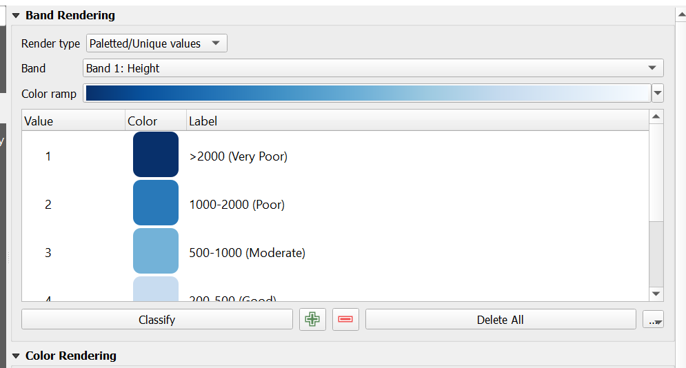
```

Click Apply and then OK

```{r}
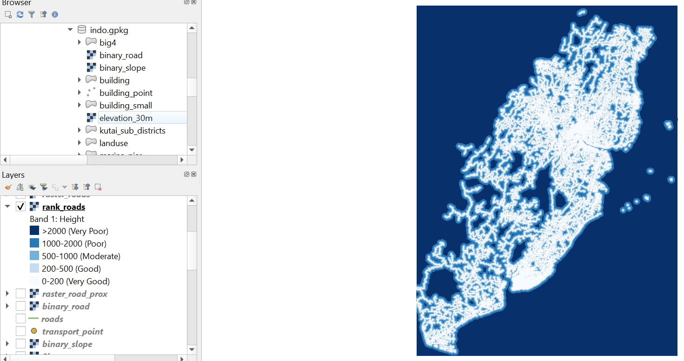
```

## 2.2 Health
### 2.2.1 Deriving health risk factor preference layer
Using the steps in 2.1, Create a layer for health risk factor.
Health risk factor: 
<=100m = 1, 
100-200m = 2, 
200-300m = 3, 
300-500m = 4, 
/>500m = 5 away from population i.e. housing areas and offices.

```{r}
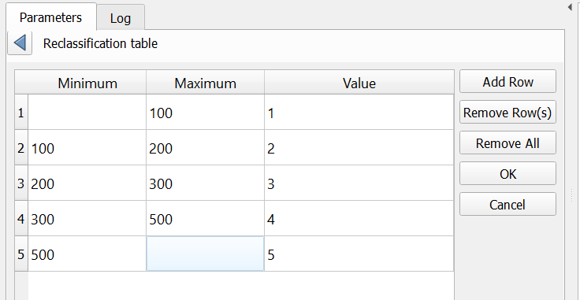
```

```{r}
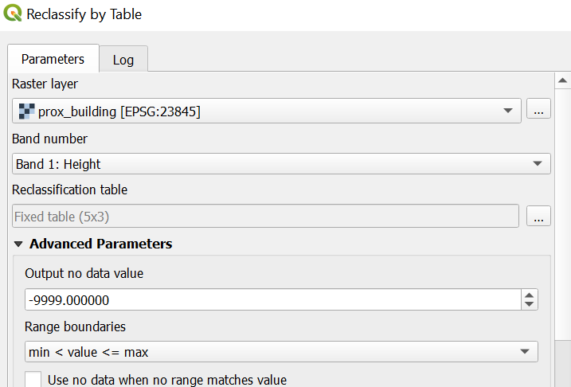
```

```{r}
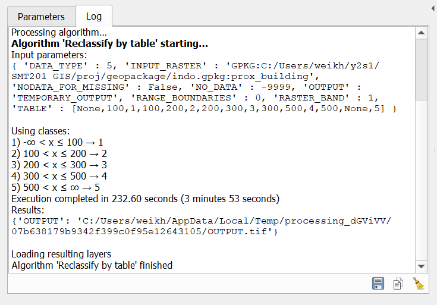
```

```{r}
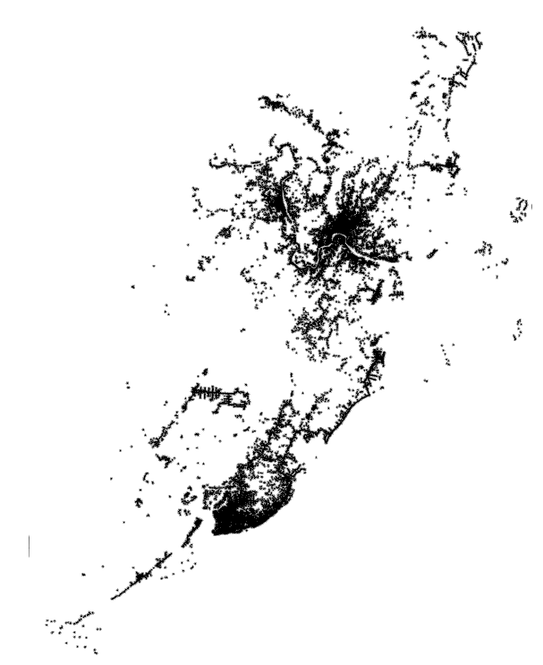
```

```{r}
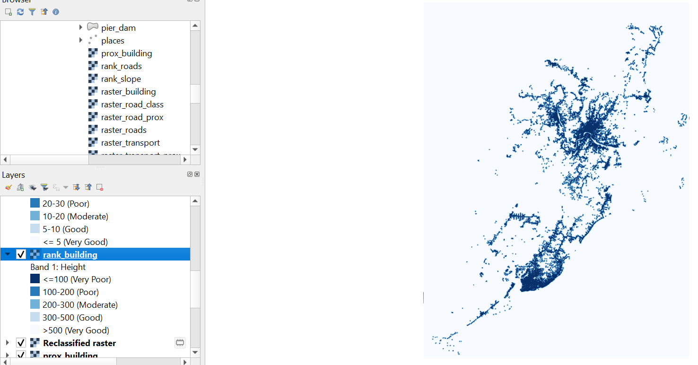
```

## 2.3 Hotspot
Load the Hotspot shp files from the browser (Titik Api Hotspot se-Indonesia Tahun [Year]).
Select the hospots that fall within the study area. This can be done through the Select by location tool. In the Select by location window:
Select Titik Api Hotspot se-indonesia Tahun [Year] layer for the Select features from input.
Intersect should be ticked.
Select kalimantan_study_area as the input for By comparing to the features from.
Under advanced options  for By comparing the features from, select Do not Filter (Better Performance).
Click Run.
Export the selected points to kalimantan gpkg. Change CRS to EPSG: 23845 – DGN95 / Indonesia TM-3 zone 54.1. For 2014, 2015 & 2017, select Points for Geometry type and untick Include z-dimension.
Merge all the hotspot layers by using the Merge Vector Layer tool (Vector > Data Management Tools > Merge Vector Layer). Select all 6 hotspot layers as the input and select EPSG: 23845 – DGN95 / Indonesia TM-3 zone 54.1 as the Destination CRS. Export the temporary merge layer to kalimantan gpkg. Change CRS to EPSG: 23845 – DGN95 / Indonesia TM-3 zone 54.1. Untick fid under Select fields to export and their export options as a new unique fid would be generated which may overlap with the existing fid.
From the Processing Toolbox, select Heatmap. In the Heatmap window

```{r}
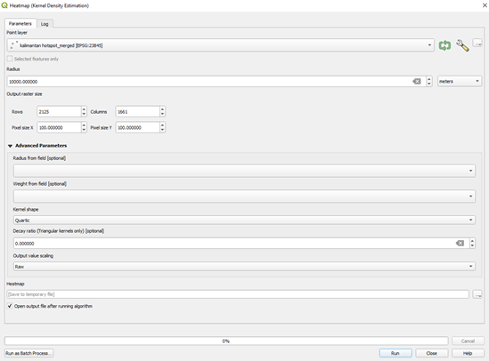
```

Select hospot_merged as the point layer.
Key in 10000 meters for Radius
Run the window.
The heat map should look like this

```{r}
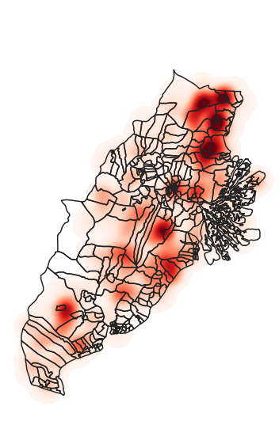
```

## 2.4 Education
Load PEDIDIKAN_PT_50k.shp KOTA_BALIKPAPAN RBI, KOTASAMARINDA RBI, KUTAIKARTANEGARA RBI and PENAJAMPASERUTARA RBI into QGIS
Merge the 4 layers together using the Merge Vector Layers tool [Vector > Data Management Tools > Merge Vector Layer]. In the Merge Vector Layers window:
Select the 4 Pedidikan layers as the Input layers.
Select EPSG: 23845 – DGN95 / Indonesia TM-3 zone 54.1 as the Destination CRS.
Run the window.
Delete duplicate points for the merged layers. Search for Delete Duplicate Geometries on the Geoprocessing Toolbox and open the tool. In the Delete Duplicate Geometries window:
Select Merged as the Input layer/
Run the window.
Export the Cleaned output layer into the geopackage as school. Change CRS to EPSG: 23845 – DGN95 / Indonesia TM-3 zone 54.1.
Count the number of schools in each Desa. This can be done using the Count points in polygon tool [Vector > Analysis > Count points in polygon]. In the Count points in polygon window:
Select the study area layer as the Polygon.
Select school for Points.
Under advanced options , select Do not Filter (Better Performance).
Run the window.
Export the Count output layer into the geopackage as school_count. Change CRS to EPSG: 23845 – DGN95 / Indonesia TM-3 zone 54.1.
Create a choropleth map using the school_count layer. Double click on the school_count layer to open the Layer Properties window. Select Symbology. In the Symbology window:
Change from Single Symbol to Graduated.
Select NUMPOINTS as the value.
Select Natural Breaks (Jenks) for Mode.
Click on Classify.
Click on Apply and Ok.
The choropleth map should look like this:

```{r}
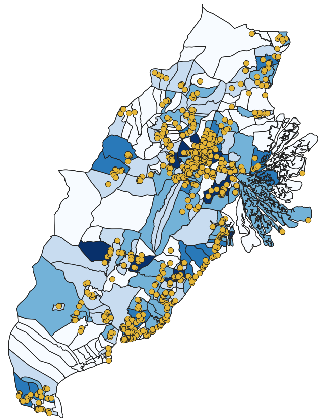
```

```{r}
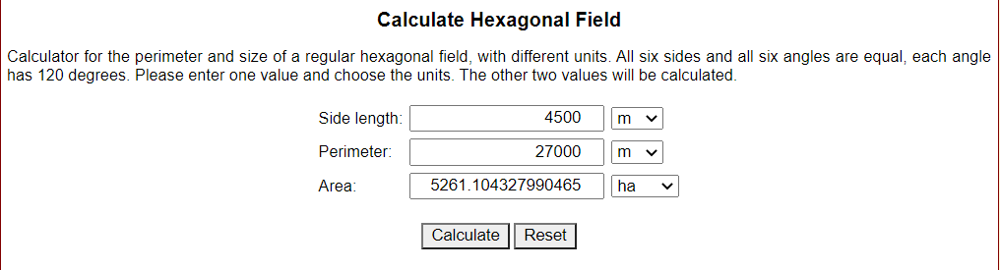
```

## 2.5 Slope
### 2.5.1 Deriving slope layer
We will compute a slope layer from the DEM layer by using the Slope operation of QGIS.
Bring in DEM SRTM 30M KALIMANTAN TIMUR layer into qgis.
From the menu bar, select Raster -> Extraction -> Clip raster by extent.
For Input layer, select DEM SRTM 30M KALIMANTAN TIMUR from the drop-down list.
For Clipping extent, select study_area
Keep the rest as default and click on the Run button.

```{r}
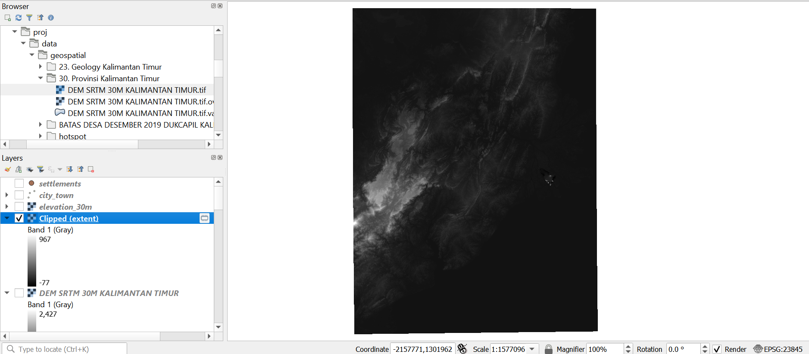
```

Save the temporary Clipped (extent) into geopackage as elevation_30m
From the menu bar, select Raster -> Analysis -> Slope.
Slope dialog window appears.
For Input layer, select elevation_30m from the drop-down list.
Keep the rest of the setting as default.
Click on the Run button.
When the computation is completed, a temporary layer called Slope will be added in the QGIS project.

```{r}
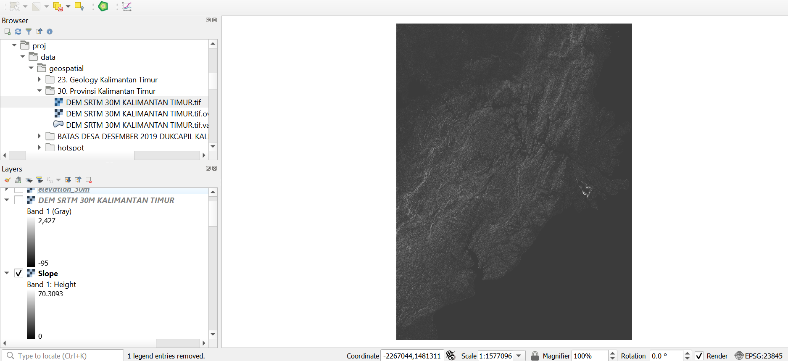
```

The legend of the Slope layer shows that the minimum and maximum values of the slope values are 0 and 70.3093 degrees respectively. The grids with darker grey indicate locations with relatively gentle slopes. On the other hand, the light grey grids indicate locations with steeper slope.
Click on Close button to close Slope function dialog window.

### 2.5.2 Slope ranking
Using steps from 2.1.4, derive slope preference data layer by scoring it  with ordinal scales of choices 5-scale.
Economic factor: 
<= 5degree slope = 5, 
5degree - 10degree = 4, 
10degree -20degree = 3, 
20degree -30degree  = 2, 
/>30degree = 1

```{r}
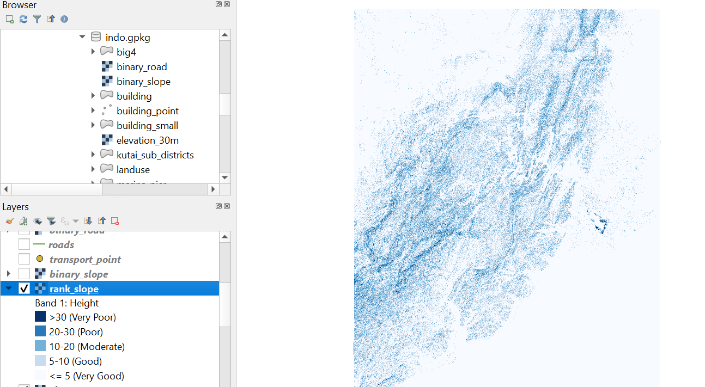
```
 
### 2.5.3 Hillshade
From the menu bar, navigate to Processing -> Toolbox. Search for Hillshade and double click the Hillshade under raster terrain analysis
For elevation model, select elevation_30m from the dropdown list.
Keep the rest of the settings as default.
Click on the run button.

```{r}
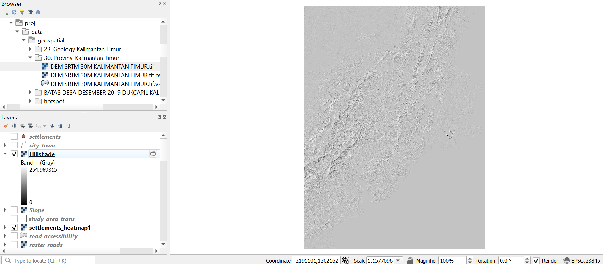
```

Save the temporary Hillshade layer into geopackage as Hillshade.

### 2.5.4 qgis2threejs
Open the properties of the Slope layer and navigate to Symbology.
For Render type, select Singleband pseudocolor from the dropdown list
For Color ramp, select Greens from the dropdown list
Click Classify -> apply -> Ok

```{r}
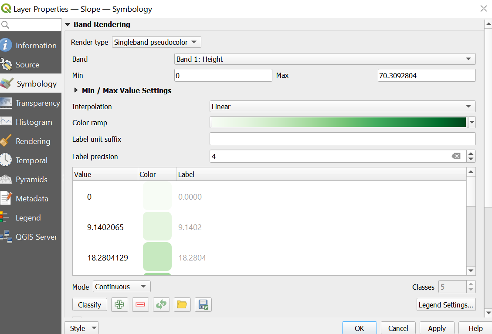
```

Ensure that Slope layer is above hillshade in the layers window

```{r}
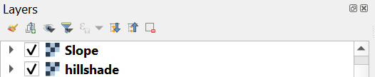
```

From the menu bar, select plugins -> manage and install plugins. Search for Qgis2threejs and double click the Install Plugin.
Select Qgis2threejs Exporter from the menu bar.

```{r}
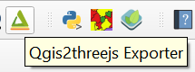
```

Select elevation_30m from the layers panel in Qgis2threejs window.
From the menu bar, select Scene -> Scene settings
Change vertical exaggeration to 25
Click on Apply and then OK	

```{r}
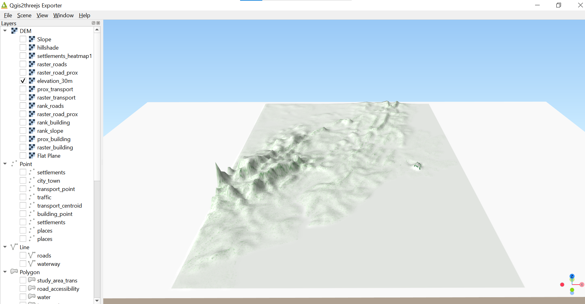
```

## 2.6 Healthcare
Click on healthcare in the layers menu to highlight the layer
From the toolbar, select Open field calculator
Set Output field name as POI_CODE
Set the expression as 1
It should look similar to this:

```{r}
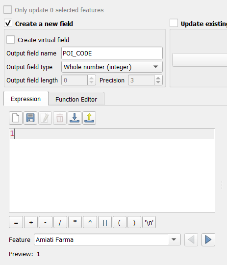
```

Click Ok
Close the attributes table
Right click on healthcare in the layers menu
Click toggle editing to turn off editing mode
Click Save
From the menu bar, select Raster -> Conversion -> Rasterise (Vector to Raster)

```{r}
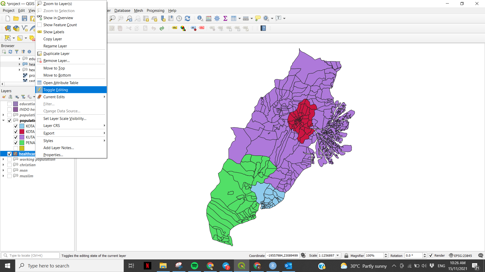
```

Set Input layer as healthcare
Set Field to use for a burn-in value as POI_CODE
Set Output raster size units as Georeferenced units
Set Width and Height as 5 metres
Set Output extent as population

```{r}
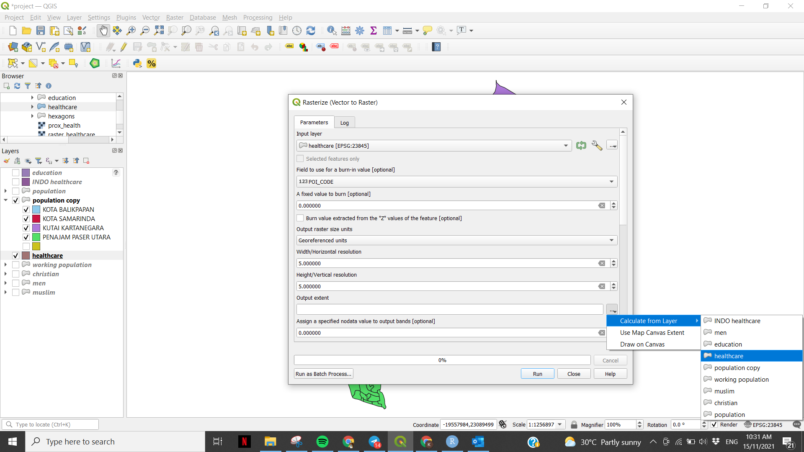
```

Click Run
Click Close
Right click on the temporary Rasterized layer and select Export -> Save as
Set Format as GeoPackage
Set File name to IN.gpkg
Set layer name to raster_healthcare
Set CRS to EPSG:23845
Click Ok
For the menu bar, select Raster -> Analysis -> Proximity (Raster Distance)
Set Input layer as ras_healthcare
Set Distance units as Georeferenced coordinates

```{r}
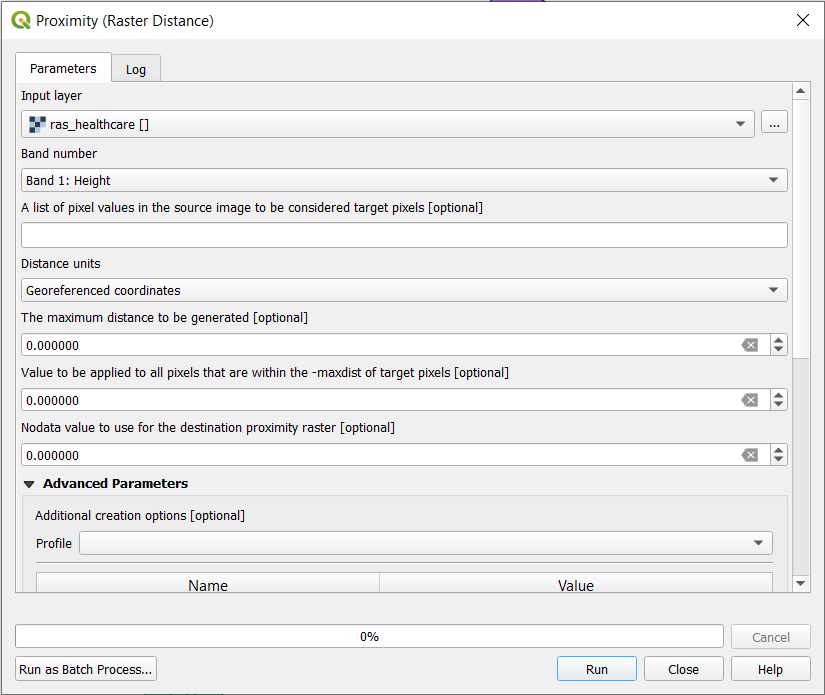
```

Click Run
Click Close
Right click on the temporary Proximity layer and select Export -> Save as
Set Format as GeoPackage
Set File name to IN.gpkg
Set layer name to prox_healthcare
Set CRS to EPSG:23845

## 2.7 Forest Fire Hotspots
Click on hotspot_merged in the layers menu to highlight the layer
From the toolbar, select Open field calculator
Set Output field name as POI_CODE
Set the expression as 1
It should look similar to this:

```{r}

```

Click Ok
Close the attributes table
Right click on healthcare in the layers menu
Click toggle editing to turn off editing mode
Click Save
From the menu bar, select Raster -> Conversion -> Rasterise (Vector to Raster)
Set Input layer as hotspot_merged
Set Field to use for a burn-in value as POI_CODE
Set Output raster size units as Georeferenced units
Set Width and Height as 5 metres
Set Output extent as population
Click Run
Click Close
Right click on the temporary Rasterized layer and select Export -> Save as
Set Format as GeoPackage
Set File name to IN.gpkg
Set layer name to ras_hotspot
Set CRS to EPSG:23845
Click Ok
For the menu bar, select Raster -> Analysis -> Proximity (Raster Distance)
Set Input layer as ras_healthcare
Set Distance units as Georeferenced coordinates
Click Run
Click Close
Right click on the temporary Proximity layer and select Export -> Save as
Set Format as GeoPackage
Set File name to IN.gpkg
Set layer name to prox_hotspot
Set CRS to EPSG:23845

## 2.8 Forest
Click on forest in the layers menu to highlight the layer
From the toolbar, select Open field calculator
Set Output field name as POI_CODE
Set the expression as 1
It should look similar to this:

```{r}

```

Click Ok
Close the attributes table
Right click on forest in the layers menu
Click toggle editing to turn off editing mode
Click Save
From the menu bar, select Raster -> Conversion -> Rasterise (Vector to Raster)
Set Input layer as forest
Set Field to use for a burn-in value as POI_CODE
Set Output raster size units as Georeferenced units
Set Width and Height as 5 metres
Set Output extent as population
Click Run
Click Close
Right click on the temporary Rasterized layer and select Export -> Save as
Set Format as GeoPackage
Set File name to IN.gpkg
Set layer name to ras_forest
Set CRS to EPSG:23845
Click Ok
For the menu bar, select Raster -> Analysis -> Proximity (Raster Distance)
Set Input layer as ras_forest
Set Distance units as Georeferenced coordinates
Click Run
Click Close
Right click on the temporary Proximity layer and select Export -> Save as
Set Format as GeoPackage
Set File name to IN.gpkg
Set layer name to prox_forest
Set CRS to EPSG:23845

## 2.8 Water Body
Click on waterbody in the layers menu to highlight the layer
From the toolbar, select Open field calculator
Set Output field name as POI_CODE
Set the expression as 1
It should look similar to this:

```{r}

```

Click Ok
Close the attributes table
Right click on forest in the layers menu
Click toggle editing to turn off editing mode
Click Save
From the menu bar, select Raster -> Conversion -> Rasterise (Vector to Raster)
Set Input layer as waterbody
Set Field to use for a burn-in value as POI_CODE
Set Output raster size units as Georeferenced units
Set Width and Height as 5 metres
Set Output extent as population
Click Run
Click Close
Right click on the temporary Rasterized layer and select Export -> Save as
Set Format as GeoPackage
Set File name to IN.gpkg
Set layer name to ras_waterbody
Set CRS to EPSG:23845
Click Ok
For the menu bar, select Raster -> Analysis -> Proximity (Raster Distance)
Set Input layer as ras_waterbody
Set Distance units as Georeferenced coordinates
Click Run
Click Close
Right click on the temporary Proximity layer and select Export -> Save as
Set Format as GeoPackage
Set File name to IN.gpkg
Set layer name to prox_waterbody
Set CRS to EPSG:23845

# 3.0 Choropleth Maps
## 3.1 Working Population
Before drawing the map, we have to create a new column for the working population.
Right click study_area in layers menu
From the Attributes Toolbar, select Open Field Calculator
Set Output field name as working age
Write the expression as follows:

```{r}
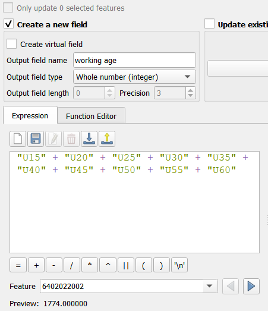
```

Click Ok
Close the field calculator by clicking the cross button on the top right corner
Click toggle editing to turn off editing mode
Click Save
A new column, working age, is added to the attribute table. Now that we have the necessary columns, we can draw the choropleth map.
Right click on study_area
Click Properties
Click Symbology from the left
Select Graduated from the drop down
For Value, select working age from the drop down
Set Color Ramp as Blues
Set mode as Natural Breaks (Jenks). This is to ensure that the values in each bin do not vary too much.

```{r}
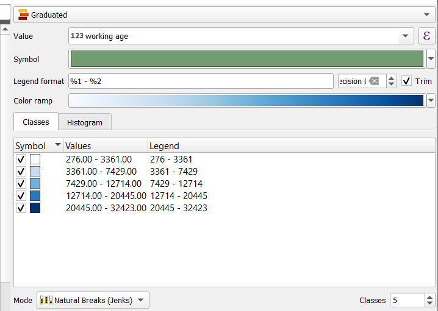
```

Click on Classify
Click on Apply
Click on OK

## 3.2 Religion
## 3.2.1 Muslim
Using the steps from 3.1, draw a choropleth map. There is no need to open the field calculator as the necessary columns are already present.
For Value, select the expression buttopm, , next to the drop down box
Type "SILAM"/"JUMLAH_PEN" into the expression panel
Click Ok

### 3.2.2 Christian
Using the steps from 3.2.1, draw a choropleth map using  "KRISTEN" /"JUMLAH_PEN" as the Value

## 3.3 Gender
Using the steps from 3.2.1, draw a choropleth map using  "PRIA" /"JUMLAH_PEN" as the Value

## 3.4 Settlements Heatmap
Bring in gis_osm_places_free_1.shp into qgis.
From the menu bar, click vector -> research tools -> Select by location 
For Input, select gis_osm_places_free_1.shp
Intersect should be selected
For By comparing the features from, select study_area. Under advanced options , select Do not Filter (Better Performance)
Click Run
Save the temporary layer into geopackage as settlements
From the menu bar, navigate to Processing -> Toolbox. Search for heatmap and double click the Heatmap (Kernel Density Estimation) under Interpolation.
For Input Point layer, select settlements from the drop-down list.
For Radius, change to 20000.
For Pixel size X and Pixel size Y, change to 50.
Keep the rest of the settings as default.
Click on the Run button.

```{r}
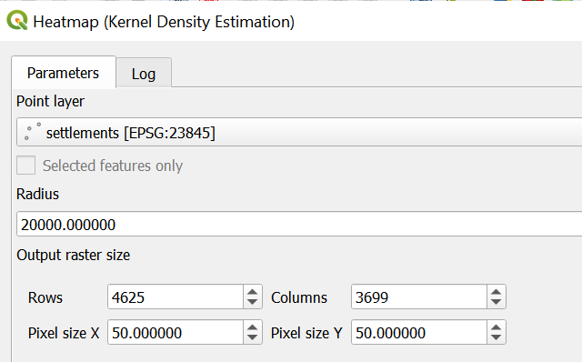
```

```{r}
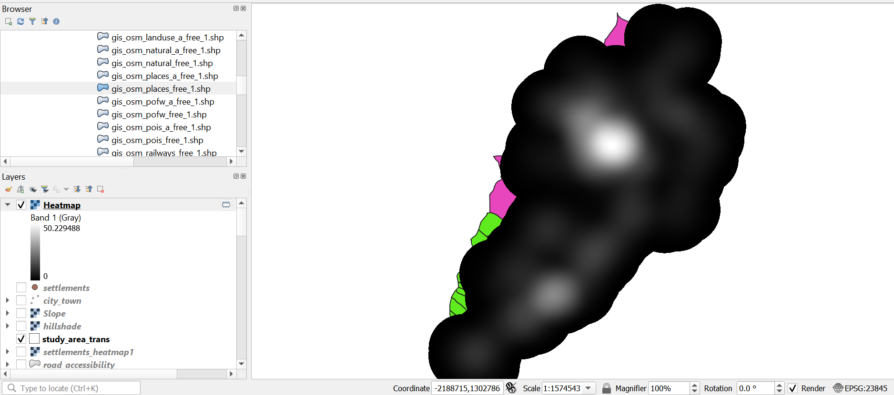
```

Save the temporary Heatmap layer into geopackage as settlements_heatmap.

## 3.5 Forest Fire Hotspot Heatmap
Select the hotspot_merged layer
From the menu bar, navigate to Processing -> Toolbox. Search for heatmap and double click the Heatmap (Kernel Density Estimation) under Interpolation.
For Input Point layer, select settlements from the drop-down list.
For Radius, change to 20000.
For Pixel size X and Pixel size Y, change to 50.
Keep the rest of the settings as default.
Click on the Run button.
Save the temporary Heatmap layer into geopackage as hotspot_heatmap.

## 3.6 Education Choropleth Map
From the menu bar, navigate to Vector -> Analysis Tool -> Count Points in Polygon. 
For Input Polygon layer, select study_area.
For Input Points layer, select schools
Run the window.
A temporary layer Count would be created. Saved the temporary layer into geopackage as school_count.
Right click on school_count
Click Properties
Click Symbology from the left
Select Graduated from the drop down
For Value, select NUMPOINTS from the drop down
Set Color Ramp as Blues
Set mode as Natural Breaks (Jenks). This is to ensure that the values in each bin do not vary too much.
Click on Classify
Click on Apply
Click on OK

# 4.0 Site Suitability
Download the AHP Template. Open the Excel template and perform AHP analysis.
This is our AHP score that we come up with.

```{r}
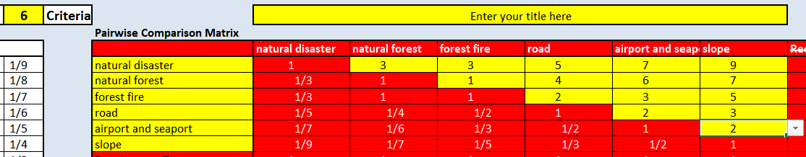
```

This is our AHP score.

```{r}
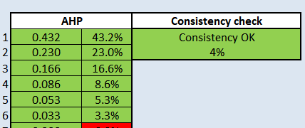
```

From the above results, health risk factor poses the most critical factor and economic factor being the least weighted factor in determining the suitable site.
The consistency check of 4% is below 10% and the inconsistency is acceptable.

## 4. 1 Prepare a composite accessibility layer
From the menu bar, navigate to Processing -> Toolbox. Search for raster calculator and double click the raster calculator under raster analysis
Copy and paste the code below into the Expression box.
"(1-("Slope@1"/70.30928))*0.033+(1-("prox_transport@1"-562.249939)/(100132.03125-562.249939))*0.053+("prox_hotspot@1"/88631.007812)*0.166+("forest_prox@1"/86003.609375)*0.23+(1-("raster_road_prox@1"/86038.75))*0.086+("waterbody_prox@1"/87802.921875)*0.432" 
 
Noticed that we used 1 - z-score of slope, transport and road as we want higher z-score to represent better site suitability.
 
For referenced layer use prox_building.
Click run.
Save the composite layer into geopackage as composite_layer

## 4.2 Identify suitable sites
We now need to identify a suitable area based on the composite accessibility layer that we have obtained. The scale of the composite accessibility layer ranges from 0.155585 to 0.690181. After investigating the various values to determine the best value to identify the composite factor score, we have decided on 0.3 to better pinpoint the ideal location.
 
In order to derive the site suitability layer, the reclassifying operation of raster GIS will be used. In QGIS, raster reclassifying can be performed by using the Reclassify by Table function.
From the Processing Toolbox, search for Reclassify by Table, double-click on it.

```{r}
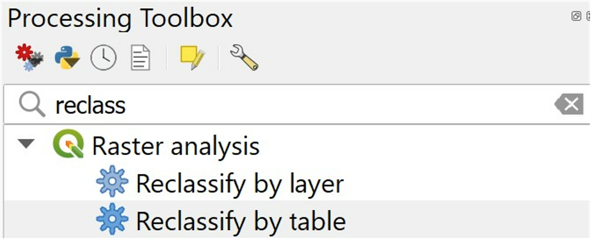
```

The dialog window of Reclassify by Table appears.
For Raster Layer, select composite_layer from the drop-down list.
For the Reclassification table, click on the icon.
The dialog window of the Fixed table appears.
Enter the value similar to the screenshot below.

```{r}
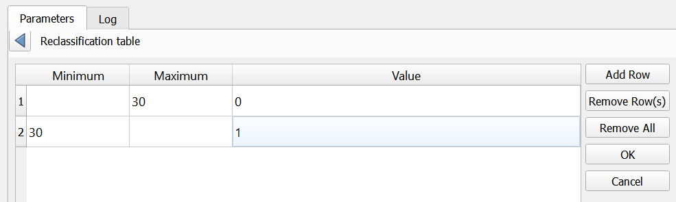
```

Click on Add Row button when you want to add a new row.
Click on OK button when you have completed the entry.
For Range boundaries, select min <= value < max.
For Output data type, select Float32 from the drop-down list.
Lastly, click on Run button to run the process.
The temporary layer should look like this.

```{r}
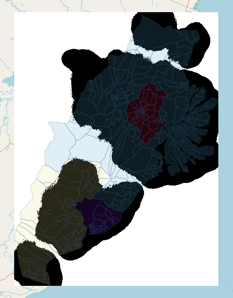
```

Clip the temporary layer into the study area.
The study area should be a dissolved polygon. Open the Dissolve window by clicking Vector -> Geoprocessing -> Dissolve.
In the Dissolve window, select study_area.

```{r}
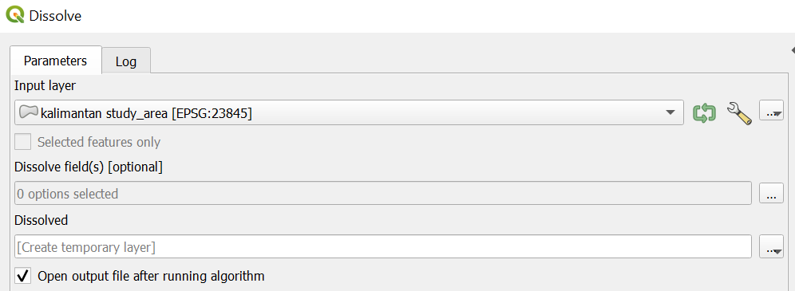
```

Run the window.
Save the temporary layer as study_area_dissolved.
Open the Clip Raster by masked extent window by Raster -> Extraction -> Clip Raster by Masked Extent.
Select the temporary layer as in Input layer.
Select study_area_dissolved as the masked layer.
Select EPSG:23845 - DGN95 / Indonesia TM-3 zone 54.1 as the Source CRS and Target CRS.
Run the window.
The temporary layer should look like the following

```{r}
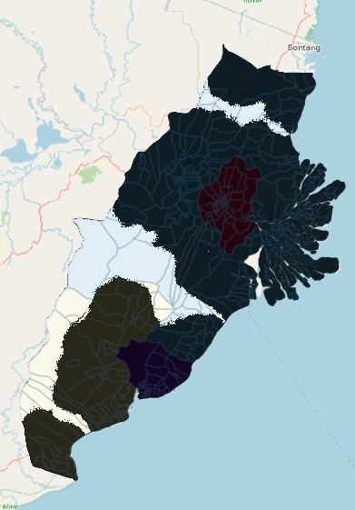
```

Save the temporary layer into geopackage as suitability

## 4.3 Vectorise suitable sites
Next, we will convert the suitable site identified above from raster into vector through vectorisation.
From the menu bar, select Raster -> Conversion -> Polygonize(Raster to Vector)
The Polygonize (Raster to Vector) dialog window appears.
For Input Layer, select suitability from the drop-down list.
For Name of the field to create, type Sites.
Keep the checkbox in front of Use 8-connectedness uncheck.

```{r}
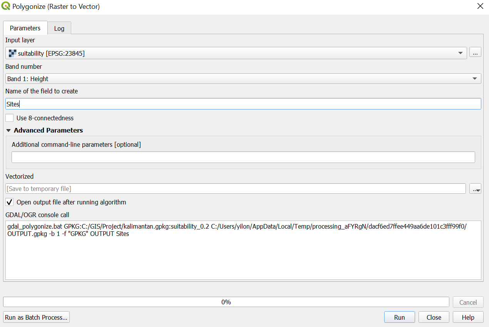
```

When you are ready, click on the Run button.
When the computation is completed, a new temporary layer called Vectorized will be added on the Layers panel and display on the view window.

```{r}
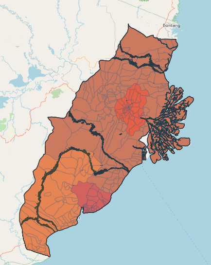
```

We would only like to save the areas which are suitable (which we previously labelled as ‘1’). 
Use the Select by expression tool 
Enter the following expression in the expression box - "Sites" = 1
Save the selected area into geopackage as suitability_vector.
Your screen should look similar to the screenshot below.

```{r}
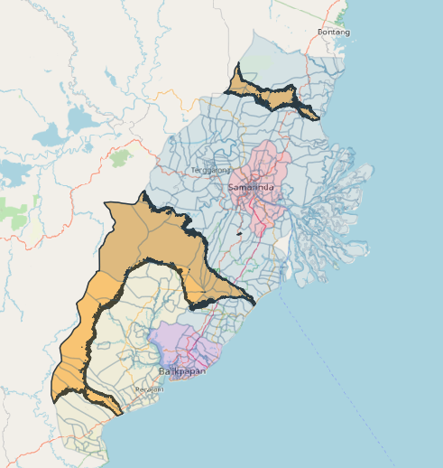
```
