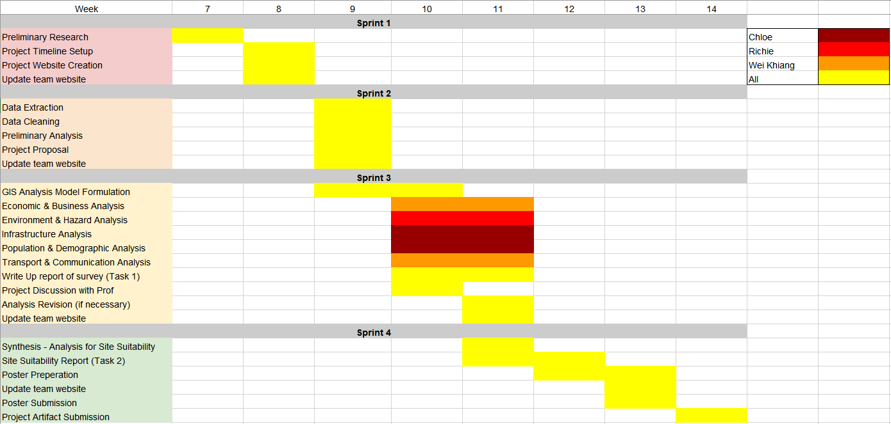

```{r setup, include=FALSE}
knitr::opts_chunk$set(echo = FALSE)
```

# 1.0 Motivation of the project

Indonesia has planned to relocate their capital from Jakarta to  Kalimantan on the island of Borneo in response to the considerable sociological issues, pollution, traffic, climate change risks, and political influences.

This move is estimated to cost nearly $33 billion (US), thus it is imperative to evaluate the site for relocation is suitable and sustainable.

# 2.0 Project objective

## objective 1
The project aims to analyse **Kutai Kartanegara Regency** and **Penajam North Paser Regency** in East Kalimantan in terms of the following:

- Population and demographic
- Economic and Businesses
- Transport and Communication
- Infrastructure
- Environment and Hazard

## objective 2

## study Area
- **All sub-districts** and **district** of **Kota Balipapan, Kota Samarinda**.

- selected districts and sub-districts of **North Penajam Paser**:
  - Babulu
  - Penajam
  - Sepaku and Waru

- selected districts and sub-districts **Kutai Kartanegara**:
  - Anggana
  - Loa Janan
  - Loa Kulu
  - Marang Kayu
  - Muara Jawa
  - Samboja
  - Sanga Sanga
  - Sebulu Tenaggarong
  - Tenggarong Seberang

We will do a **site suitability analysis** of the study area above whereby the most suitable site would be recommended for the relocation.

# 3.0 Data

+ [Batas Desa & Data Kependudukan Tahun 2019 Seluruh Indonesia](https://www.indonesia-geospasial.com/2020/04/download-shapefile-shp-batas-desa.html).  This data set provides comprehensive population data at the sub-district level.  In Indonesia local language, they are known as **kota** (i.e. urban sub-district) and **desa** (i.e. rural sub-district).  You are required to download data set for Provinsi Kalimantan Timur (i.e. East Kalimantan Province).

+ [Rupa Bumi Iindonesia (RBI) Provinsi Kalimantan Timur Perwilayah (Kabupaten/Kota)](https://www.indonesia-geospasial.com/2020/01/shp-rbi-provinsi-kalimantan-timur.html). The term rupabumi means topographic.  This data repository provides a coprehensive collection of topographical data layers of East Kalimantan. You are required to download data of Kota Balikpapan, Kota Samarinda, Penajam Paser Utara and Kutai Kartanegara.

+ [DEM SRTM 30m](https://www.indonesia-geospasial.com/2020/01/download-dem-srtm-30-meter-se-indonesia.html), digital elevation model at 30m resolution.

+ [Geological data](https://www.indonesia-geospasial.com/2020/03/download-data-shapefile-shp-geologi-se.html) layer.

+ [Forest fire hot spot data](https://www.indonesia-geospasial.com/2020/04/shapefile-shp-titik-api-hotspot.html). This repository provides several years of forest hot spots data.

+ [Buildings and Settlements](https://www.indonesia-geospasial.com/2020/12/download-shp-pemukiman-detail-seluruh.html).

# 4.0 Scope of work

- Project Timeline Setup
- Project Website Creation
- Preliminary Research
  - Data Extraction
  - Data Cleaning
  - Preliminary Analysis
- Project Proposal

- GIS Analysis Model Formulation
  - Economic & Business Analysis
  - Environment & Hazard Analysis
  - Infrastructure Analysis
  - Population & Demographic Analysis
  - Transport & Communication Analysis
- Write Up report of survey (Task 1)

- Synthesis: Analysis for Site Suitability
  - Site Suitability Report (Task 2)
- Poster Preparation
- Project website finalization


# 5.0 Project schedule including a Gannt chart

```{r}

```
