```{r setup, include=FALSE}
knitr::opts_chunk$set(echo = FALSE)
```

# 1.0 Population and Demographic
## 1.1 Population
```{r}
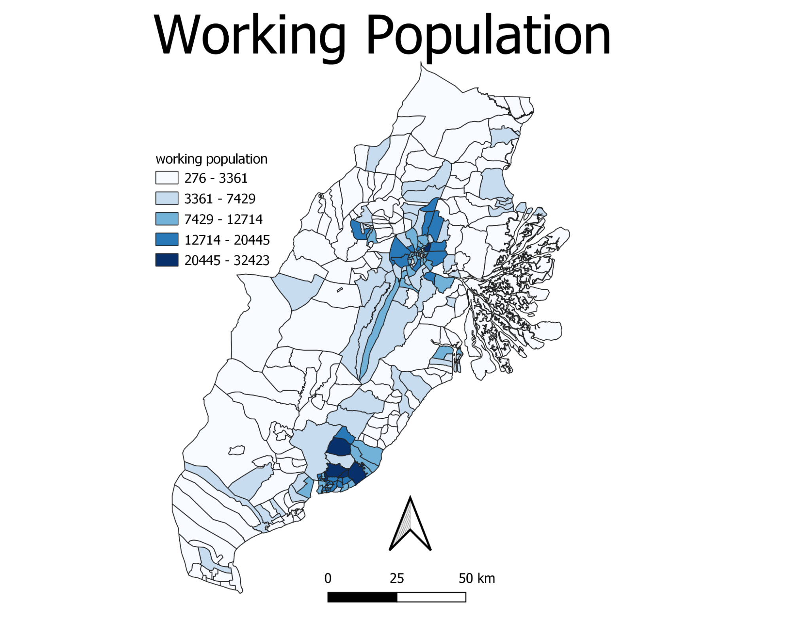
```
```{r}
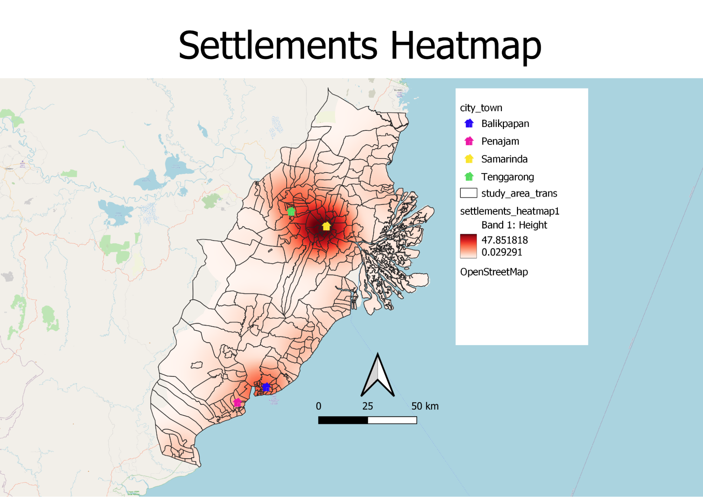
```
These maps show the distribution of the working population and settlement heatmap across the study area. From the working population map, we can see that there are 2 highly populated areas, one in Samarinda, and one in Balikpapan, with populations ranging from 13529 to 45505. The settlement heatmap also tells us the same thing. 

The capital should not be too close to the major settlements to avoid the disruption of too many local lives. However, it should not be too far from the major settlements as well to allow the new capital access to resources of an already established city, such as clean water, electricity, and human capital.

## 1.2 Demographics
### 1.2.1 Religion
```{r}
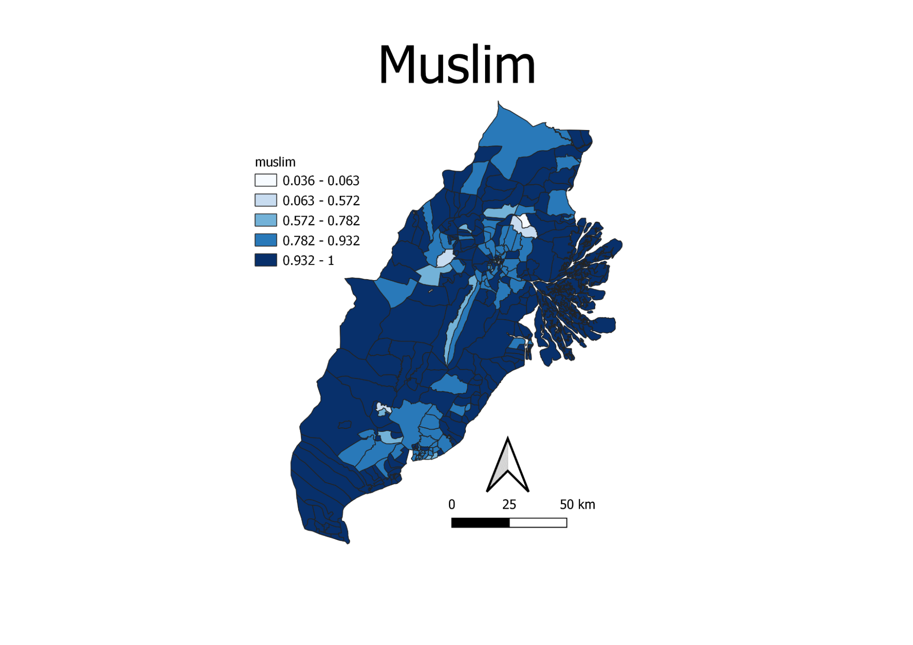
```
```{r}
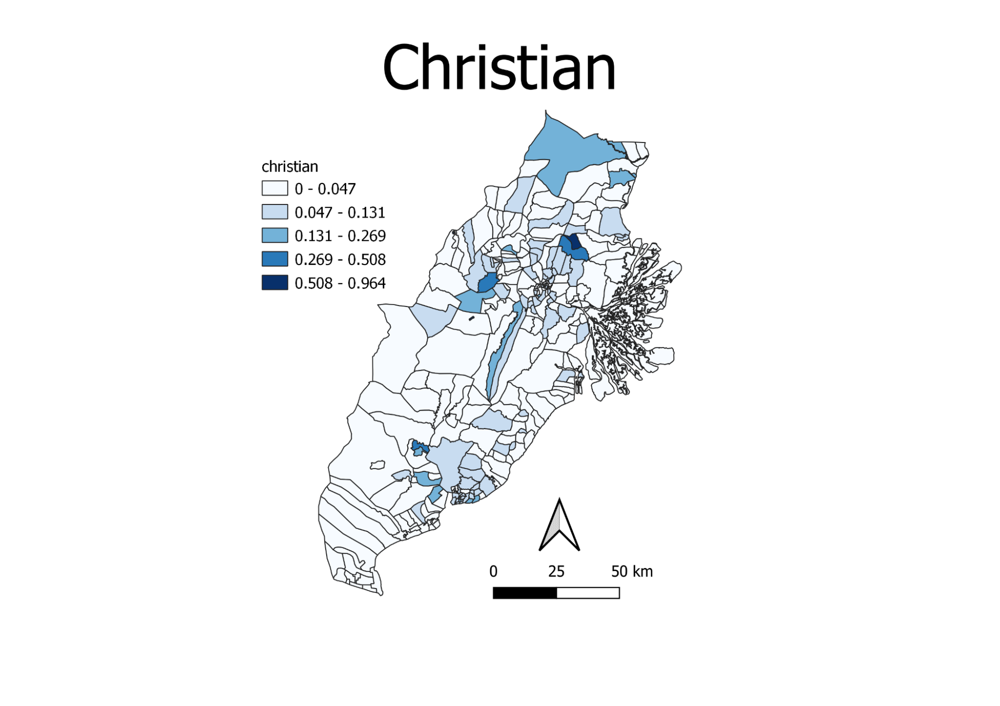
```
These maps show the distributions of the most common religions across our study area. The two most common religions are islam and christianity. From the maps, we can see that Muslims are more common in Indonesia. For areas that are not largely dominated by Muslims, there are often many Christians.

Understanding the religious landscape of the new capital is important. Since these are the most common religions, corresponding religious buildings should be built in the capital to ensure that the majority of the population can easily practice their religions.

### 1.2.2 Gender
```{r}
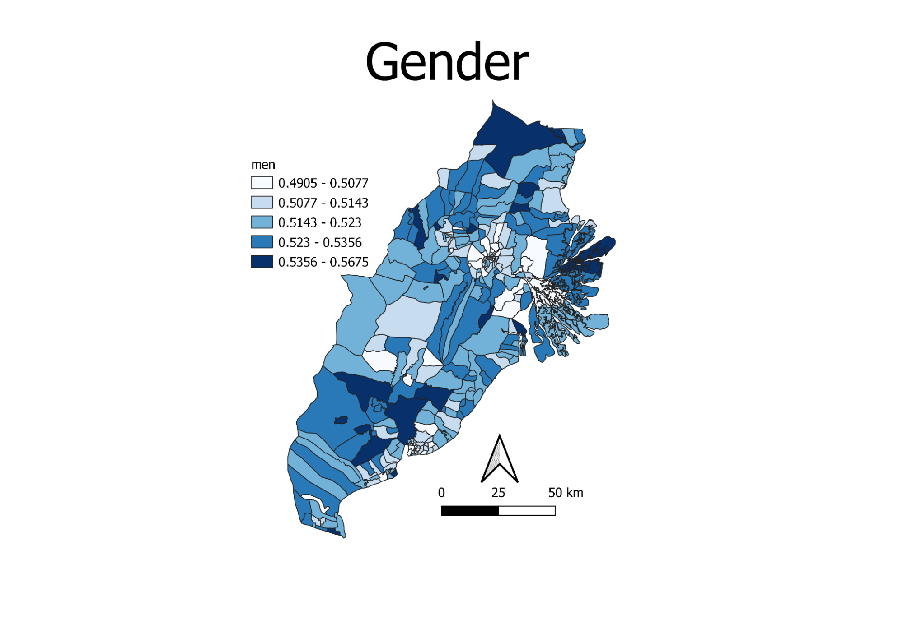
```

This map shows the proportion of men in each area across the study area. From the map, we can see that most areas generally have an even mix of males and females. However, some areas still have a relatively larger proportion of men. 

It is important to ensure that there is a relatively even mix of genders. Men are usually more suited for physical labour, which would be important in building up a new capital. It is also important to ensure that there is a good mix of men and women as well distributed areas tend to be more developed. 

# 2.0 Economic and Businesses
## 2.1 Agriculture

```{r}
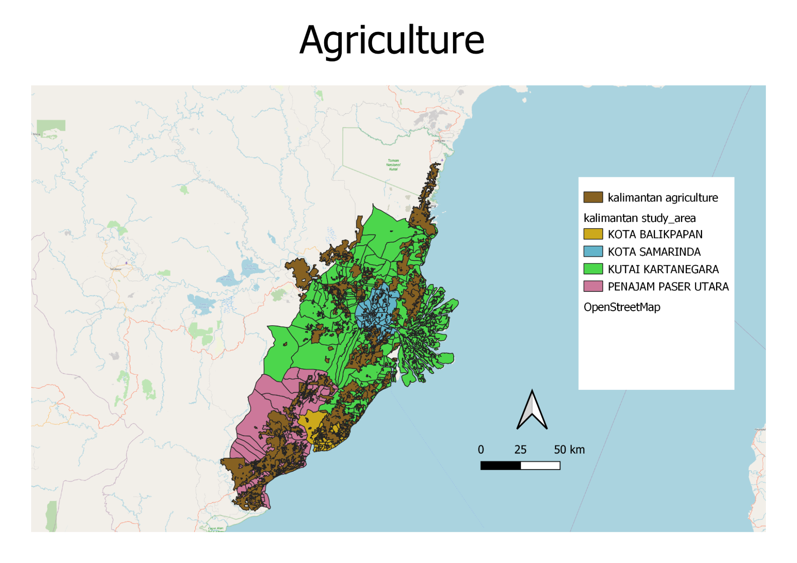
```
This map shows the distribution of agricultural land used (plantation, farming and rice field). The land is widely spread across the study area. A significant portion of Penajam and Balikpapan is used for agriculture.

The consideration behind utilising areas of existing agricultural land may be crucial as using such land can displace farmers and citizens making a livelihood with these land. Additionally, this might impact the economy on a larger scale depending on the type of agricultural product they are producing as this lowers the stock of the agricultural product. 

## 2.2 Education

```{r}
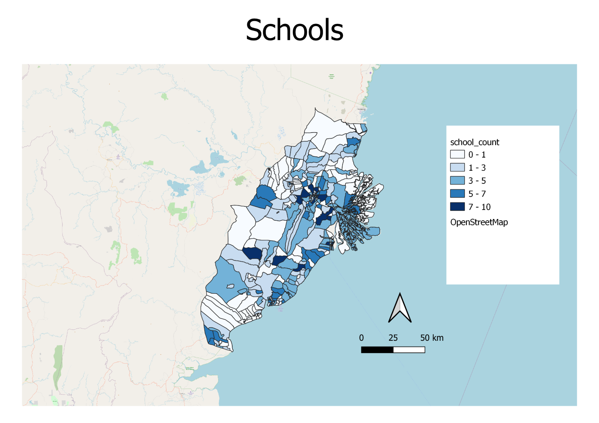
```
This map shows the distribution of existing schools within the study area. Many of these schools are concentrated in Kota Samarinda with some in Penajam. 

Although schools can be built while building the new capital, it would be good to identify the existing infrastructure available for schools and leverage on such resources or even utilising existing education resources such as facilities and manpower (teaching staff). The availability of schools is also a sign that the population in the area are educated.

# 3.0 Transport and Communication
## 3.1 Airport and Seaport

```{r}
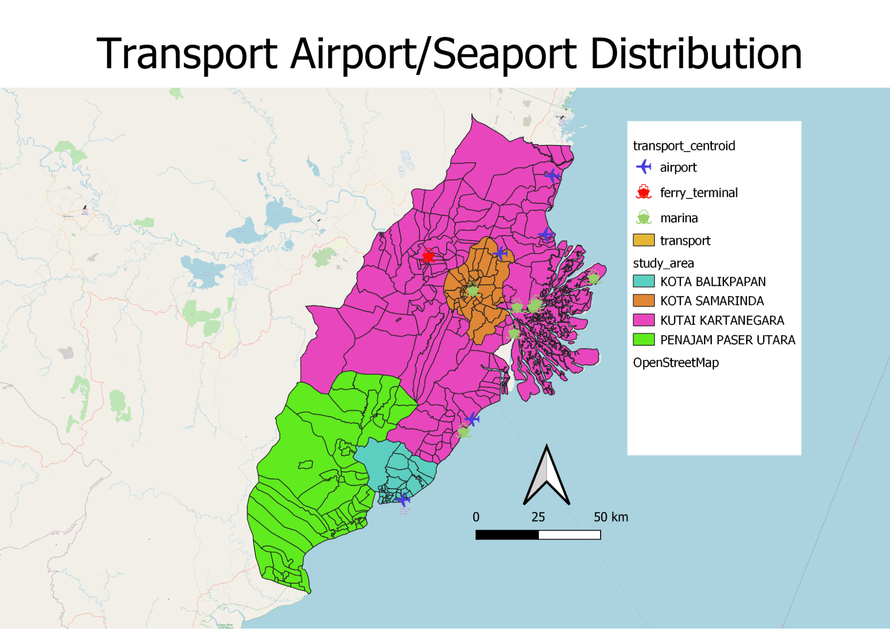
```
This map shows the distribution of airports and seaports (airports and marina/ ferry terminal) in our study area. Seaports and airports are important modes of transportation into and out of the country. It is crucial for the new capital to be accessible to these transportation as large amounts of materials need to be transported to build the new capital. 

Not to mention, it would help to facilitate a booming business environment in the new capital as imports and exports become more accessible. It also allows more tourists to visit the capital, be it for business or leisure reasons.

## 3.2 Road

```{r}
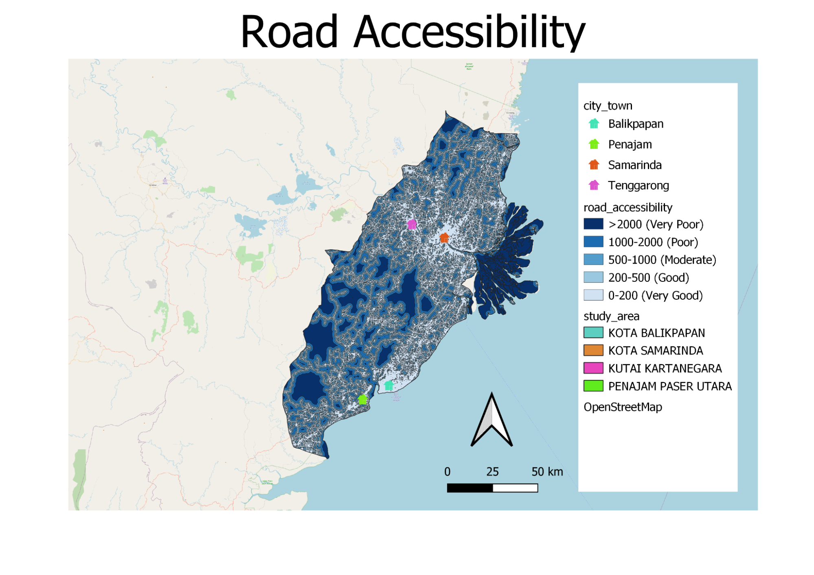
```
This map shows the distribution of roads (pedestrian and vehicle) in our study area. From the map, we can see that the 4 major city/town (Balikpapan, Penajam, Samarinda and Tennggarong) have very good accessibility to roads. Currently, the capital’s perennial traffic jams have been cited by Jokowi’s administration as one of the main reasons behind the decision to relocate the country’s administrative hub from Jakarta. Annual economic loss due to traffic congestion in Jakarta at 100 trillion rupiah (US$7.04 billion). Hence, it is crucial that there is sufficient and accessible road infrastructure for the new capital.

# 4.0 Infrastructure
## 4.1 Water bodies and Waterways 

```{r}
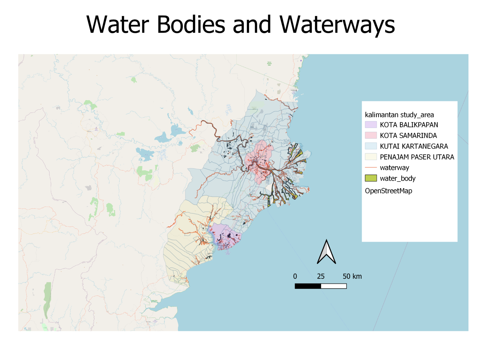
```
This map shows the major waterways (rivers or canals) as well as the water body (rivers). Most of them flow through Kutai Kartenegara and Kota Samarinda with some smaller ones flowing in Penajam. These waterways can be helpful where there is ample flow of water to the sea which can prevent the area from overflooding which is what is happening in Jakarta. However, excessive amounts without a proper channel of flow can cause flooding.

## 4.2 Buildings
```{r}
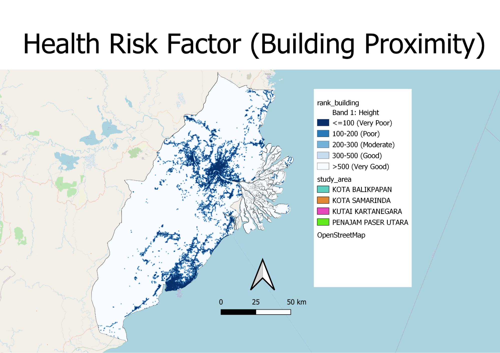
```
This map shows the proximity of buildings in our study area. The selected site should be away from population (i.e. housing areas and buildings) as sufficient space is needed to make way for the new capital. Furthermore, it is to avoid disease spreading to the nearby population given that we are in the midst of a pandemic

# 5.0 Environment and Hazard
## 5.1 Forest Fire

```{r}
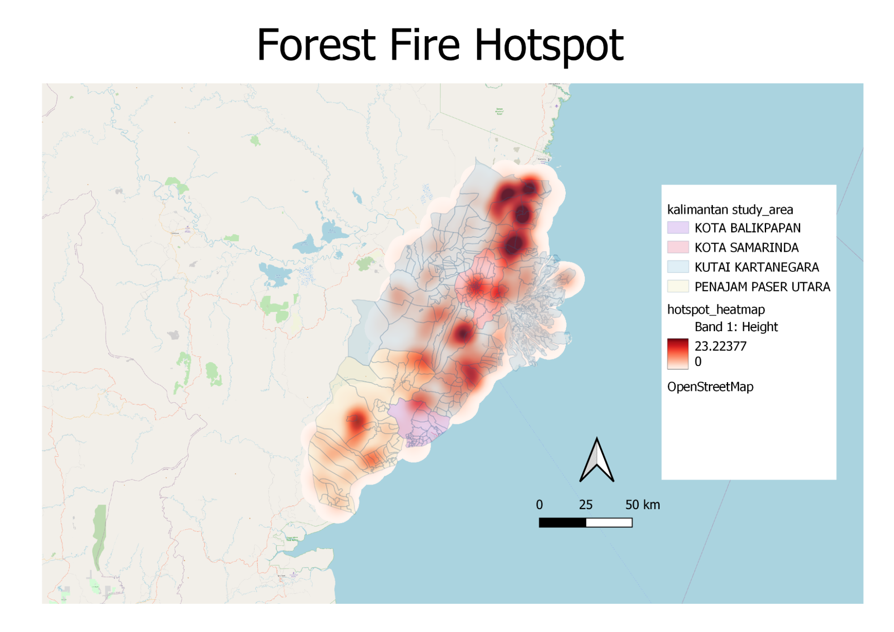
```
This map shows the concentration of forest fire hotspots in our study area. Forest fire, typically from slash and burn techniques from local agriculture, can cause excessive haze which is detrimental to health.

A high density of forest fires can be found in Northern Kutai Kartanegara with some in Samarida and Penamjan.

## 5.2 Forest

```{r}
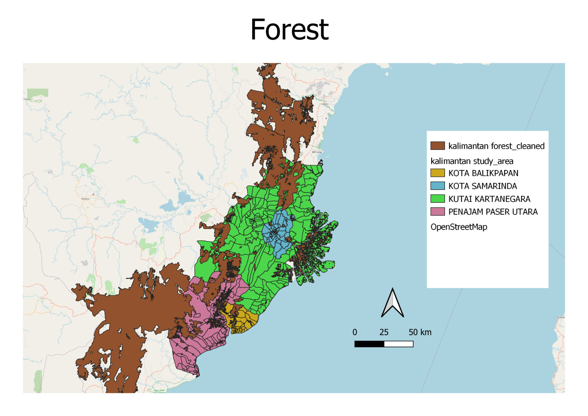
```
This map shows the distribution of forests (primary and secondary rainforest, primary and secondary mangrove forest and plantation forest) in the study area. Most of the forest is located in the southern and northern regions of Penajam as well as the northern region of Kutai Kartanegara. There are also some mangrove forests in particular in the western region of Kutai Kartanegara.

As most of these forests are primary and secondary forests, it would be wise to avoid these regions as these forests contain a wide variety of biodiversity and deforestation can have many adverse impacts including soil erosion, flooding and increased greenhouse gases.

## 5.3 Slope
```{r}
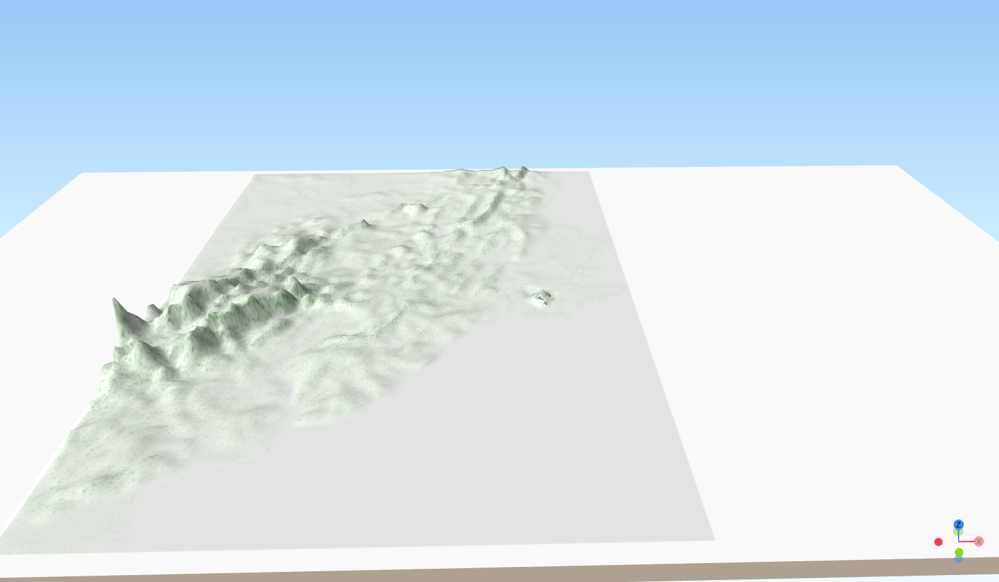
```
<a href="https://smt201-g1t11-map.netlify.app" target="_blank">Click here for terrain map</a>

This map shows that there is a concentration of mountainous areas in the south-west part of our study area, around Penajam Paser Utara. The selected site should avoid steep slopes. This is because construction at steep slopes tends to involve a lot of cut-and-fill and will lend to relatively higher development cost. Furthermore, landslides are one of the common natural disasters in Indonesia. Hence, the selected site for the new capital should avoid areas prone to landslides, which are near mountainous areas.