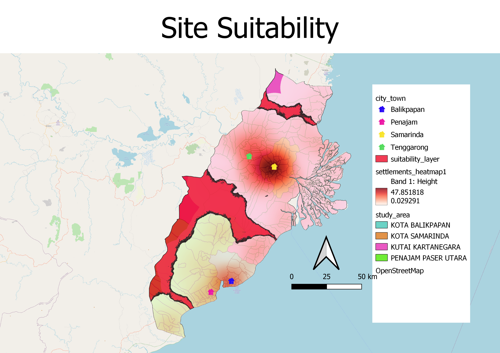

```{r setup, include=FALSE}
knitr::opts_chunk$set(echo = FALSE)
```
# Site Suitability
```{r}

```
<a href="https://smt201-g1t11-site.netlify.app" target="_blank">Click here to view our site suitability</a>

The site suitability was computed using the AHP template based on 6 factors: (1) Slope (2) Proximity to natural disaster hotspots (3) Natural forests (4) Forest fire hotspots (5) Roads (6) Air and seaports. We decided not to incorporate the last factor, proximity to urban settlements, as we found it hard to computate a suitable range that would be not too far nor too close to urban settlements. We thus created a settlement heatmap to identify the most suitable site while comparing it with the suitability layer based on the AHP score.
After experimenting with different minimum composite scores, we decided to use 0.3. This is because using composite score > 0.3 gives us a result without too many or excessively large areas. With a composite score smaller than 0.3, we found that the areas we got were too small and would not fit in the 4500 - 5500 hectare range. Similarly, using a composite score above 0.3 resulted in extremely large areas that would span across half the study space.
